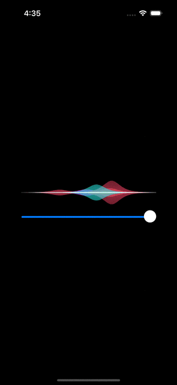

 

# Siri UI Kit
An attempt to generate Siri UI elements and distil them into a simple package

## `SiriQueryView`
The "query view", which is the cool spectrum of blobby colors, is based on the Objective C implementation from https://github.com/Taxiway/SiriView, dragged, kicking and scream into Swift.

This is purely an attempt on my part to try and better understand ObjC and practice converting code from one to the other.

The control needs some updating to provide a better painting support then simply call it's refresh method repeatedly

